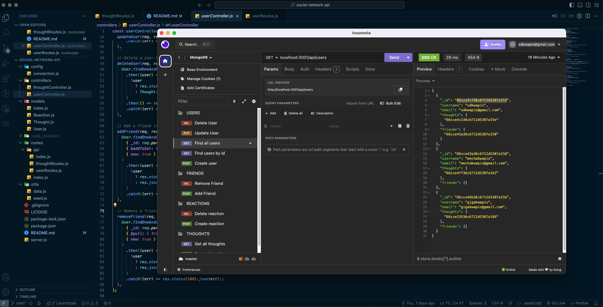

# Social Network API 	  

## Table Of Contents
- [Description](#description)
- [Installation](#installation)
- [Usage](#usage)
- [Visuals/Links](#visuals/links)
- [Contributing](#contributing)
- [License](#license)
- [Tests](#tests)
- [Questions](#questions)

# Description
An API for a social network web application where users can share their thoughts, react to friends’ thoughts, and create a friend list.

# Installation
In order to run the application you need to access the terminal  and run the local host using 'npm run dev'. From there you can access the database from a program like insomnia and test all of the routes using GET, POST, PUT, and DELTE requests.

# Usage
This is a backend specific application for an up-and-coming social media platform. Through GET, POST, PUT, and DELTE requests you can add/update users, add/delete friends, create new 'thoughts', and add reactions to thoughts.

# Visuals/Links

https://github.com/SDKwapis/social-network-api

# Contributing
This project was built using class materials and rewatching the class recordings. Certain syntax and definitions were looked up stack overflow.

# License
MIT

# Tests
All tests were run through insomnia and console logs.

# Questions
[GitHub Profile](https://github.com/SDKwapis)
For questions or comments please reach out to me at: sdkwapis@gmail.com